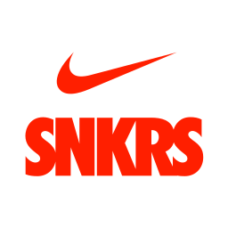

<!-- PROJECT SHIELDS -->
<!--
*** I'm using markdown "reference style" links for readability.
*** Reference links are enclosed in brackets [ ] instead of parentheses ( ).
*** See the bottom of this document for the declaration of the reference variables
*** for contributors-url, forks-url, etc. This is an optional, concise syntax you may use.
*** https://www.markdownguide.org/basic-syntax/#reference-style-links
-->
[![Contributors][contributors-shield]][contributors-url]
[![Forks][forks-shield]][forks-url]
[![Stargazers][stars-shield]][stars-url]
[![Issues][issues-shield]][issues-url]
[![MIT License][license-shield]][license-url]
[![LinkedIn][linkedin-shield]][linkedin-url]


<!-- PROJECT LOGO -->
<br />
<p align="center">
  <a href="https://github.com/mosuswalks/snkrs-bot">
    
  </a>

  <h3 align="center">snkrs-bot</h3>

  <p align="center">
    SNKRS Canada Automated Bot
    <br />
    <a href="https://github.com/mosuswalks/snkrs-bot"><strong>Explore the docs »</strong></a>
    <br />
    <br />
    <a href="https://github.com/mosuswalks/snkrs-bot">View Site</a>
    ·
    <a href="https://github.com/mosuswalks/snkrs-bot/issues">Report Bug</a>
    ·
    <a href="https://github.com/mosuswalks/snkrs-bot/issues">Request Feature</a>
  </p>
</p>


<!-- TABLE OF CONTENTS -->
## Table of Contents

* [About the Project](#about-the-project)
  * [Built With](#built-with)
* [Getting Started](#getting-started)
  * [Prerequisites](#prerequisites)
  * [Installation](#installation)
* [Usage](#usage)
* [Roadmap](#roadmap)
* [Contributing](#contributing)
* [License](#license)
* [Contact](#contact)
* [Acknowledgements](#acknowledgements)


<!-- ABOUT THE PROJECT -->
## About The Project
A fully automated sneaker bot for purchasing exclusive sneakers on the Nike Canada SNKR's site.


Feel free fork and edit this project to your liking.
<!-- [![Product Name Screen Shot][product-screenshot]](https://example.com) -->


### Built With

* [Node.js](https://nodejs.org/en/)
* [Puppeteer](https://github.com/puppeteer/puppeteer)
* [Node Cron](https://github.com/node-cron/node-cron)


<!-- GETTING STARTED -->
## Getting Started

To get a local copy up and running follow these simple steps.

### Prerequisites

You must already have a valid [Nike](https://nike.com) account and credit card tied to the account. 


* yarn
```sh
yarn upgrade --latest
```
* npm 
```sh
npm install npm@latest -g
```


### Installation
 
1. Clone the repo
```sh
git clone https://github.com/mosuswalks/snkrs-bot.git
```
2. Install NPM packages
```sh
yarn install
```
or
```sh
npm install
```

<!-- USAGE EXAMPLES -->
## Usage

1. You'll need to reate a .env file and add the following variables.

```sh
EMAIL=youremail@example.com
PASS=yournikeaccountpassword
CVC=yourcreditcardcvc
```

2. In the bot.js file, edit the following lines.


3. Run the script like you normally would or by invoking the Cron Job (currently set to 6am)

```sh
node bot.js
```

or 

```ch
node cron.js
```


<!-- ROADMAP -->
## Roadmap

See the [open issues](https://github.com/mosuswalks/snkrs-bot/issues) for a list of proposed features (and known issues).


<!-- CONTRIBUTING -->
## Contributing

Contributions are what make the open source community such an amazing place to learn, inspire, and create. Any contributions you make are **greatly appreciated**.

1. Fork the Project
2. Create your Feature Branch (`git checkout -b feature/AmazingFeature`)
3. Commit your Changes (`git commit -m 'Add some AmazingFeature'`)
4. Push to the Branch (`git push origin feature/AmazingFeature`)
5. Open a Pull Request


<!-- LICENSE -->
## License

Distributed under the MIT License. See `LICENSE` for more information.


<!-- CONTACT -->
## Contact

Mohamed - [@](https://mohamedabdi.dev/) - mohamedaabdi@yahoo.ca

Project Link: [https://github.com/mosuswalks/snkrs-bot](https://github.com/mosuswalks/snkrs-bot)


<!-- MARKDOWN LINKS & IMAGES -->
<!-- https://www.markdownguide.org/basic-syntax/#reference-style-links -->
[contributors-shield]: https://img.shields.io/github/contributors/mosuswalks/snkrs-bot.svg?style=flat-square
[contributors-url]: https://github.com/mosuswalks/snkrs-bot/contributors
[forks-shield]: https://img.shields.io/github/forks/mosuswalks/snkrs-bot.svg?style=flat-square
[forks-url]: https://github.com/mosuswalks/snkrs-bot/network/members
[stars-shield]: https://img.shields.io/github/stars/mosuswalks/snkrs-bot.svg?style=flat-square
[stars-url]: https://github.com/mosuswalks/snkrs-bot/stargazers
[issues-shield]: https://img.shields.io/github/issues/mosuswalks/snkrs-bot.svg?style=flat-square
[issues-url]: https://github.com/mosuswalks/snkrs-bot/issues
[license-shield]: https://img.shields.io/github/license/othneildrew/Best-README-Template.svg?style=flat-square
[license-url]: https://github.com/mosuswalks/snkrs-bot/blob/master/LICENSE
[linkedin-shield]: https://img.shields.io/badge/-LinkedIn-black.svg?style=flat-square&logo=linkedin&colorB=555
[linkedin-url]: https://linkedin.com/in/mohamedaabdi
[product-screenshot]: images/screenshot.png
[botjs-code]: ./images/snkr-bot.svg
